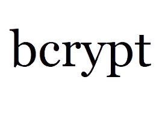

<a name="readme-top"></a>

<p align="center">
  <a href="https://github.com/adkoprek/BCrypt/graphs/contributors">
	  
  </a>
  <a href="https://github.com/adkoprek/BCrypt/network/members">
	  
  </a>
  <a href="https://github.com/adkoprek/BCrypt/stargazers">
	  
  </a>
  <a href="https://github.com/adkoprek/BCrypt/issues">
	  
  </a>
  <a href="https://github.com/adkoprek/BCrypt/blob/master/LICENSE.txt">
	  
  </a>
</p>

<br />
<div align="center">
  <a href="https://github.com/adkoprek/WTE">
    
  </a>

  <h3 align="center">BCrypt - Password Encryption</h3>

  <p align="center">
    A worldwide used algorithem to encrypt passwords
    <br />
    <a href="https://en.wikipedia.org/wiki/Bcrypt">Wiki Article</a>
    ·
    <a href="https://github.com/adkoprek/BCrypt/issues/new?labels=bug&template=bug-report---.md">Report Bug</a>
    ·
    <a href="https://github.com/adkoprek/BCrypt/issues/new?labels=enhancement&template=feature-request---.md">Request Feature</a>
  </p>
</div>

### Built With
[![CPP][CPP.js]][CPP-url]

<!-- GETTING STARTED -->
## Getting Started

If you want your own copy just follow this steps

Clone the repo
```bash
git clone https://github.com/adkoprek/BCrypt
```

Create a cmake directory
```bash
mkdir cmake
cd cmake
```

Build the project and install
```bash
cmake .. -DCMAKE_BUILD_TYPE=Release
make install
```

### Prerequisites

  - C++ 17 compiler
  - CMake 3.5 Version

## Usage

The include header is names `bcrypt.h` that you have to include in your program
And link the appropriate library `libbcrypt.so`


## Contributing

Contributions are what make the open source community such an amazing place to learn, inspire, and create. Any contributions you make are **greatly appreciated**.

If you have a suggestion that would make this better, please fork the repo and create a pull request. You can also simply open an issue with the tag "enhancement".
Don't forget to give the project a star! Thanks again!

1. Fork the Project
2. Create your Feature Branch (`git checkout -b feature/AmazingFeature`)
3. Commit your Changes (`git commit -m 'Add some AmazingFeature'`)
4. Push to the Branch (`git push origin feature/AmazingFeature`)
5. Open a Pull Request

## License

Distributed under the MIT License. See `LICENSE.txt` for more information.

[CPP.js]: https://img.shields.io/badge/C%2B%2B-00599C?style=for-the-badge&logo=c%2B%2B&logoColor=white
[CPP-url]: https://isocpp.org/
